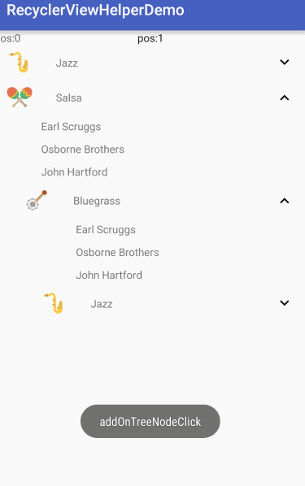

RecyclerViewHelper
============

Android library for easy to use `RecyclerView`

- Paginate
- Click/Select Mode
- Expandable

Features
--------

- [MarkoMilos/Paginate](https://github.com/MarkoMilos/Paginate): Wrapper RecyclerView.Adapter

- [lucasr/twoway-view](https://github.com/lucasr/twoway-view/): Implement RecyclerView.OnItemTouchListener

- [TellH/RecyclerTreeView](https://github.com/TellH/RecyclerTreeView) : Add or Remove items in RecyclerView.Adapter

Screenshot
--------


<br/>




Setup
--------

Gradle:
```groovy
compile 'com.bobomee.android:recyclerviewhelper:1.0.3'
```

Usage
--------

- Paginate : see [MarkoMilos/Paginate](https://github.com/MarkoMilos/Paginate) or [PaginateFragment](https://github.com/BoBoMEe/RecyclerViewHelper/blob/master/app/src/main/java/com/bobomee/android/recyclerviewhelperdemo/fragment/PaginateFragment.java)

- Select/Click: see [lucasr/twoway-view](https://github.com/lucasr/twoway-view/) or [ItemSelectFragment](https://github.com/BoBoMEe/RecyclerViewHelper/blob/master/app/src/main/java/com/bobomee/android/recyclerviewhelperdemo/fragment/ItemSelectFragment.java)

- Expanable : See [TellH/RecyclerTreeView](https://github.com/TellH/RecyclerTreeView) or [ExpandRecyclerFragment](https://github.com/BoBoMEe/RecyclerViewHelper/blob/master/app/src/main/java/com/bobomee/android/recyclerviewhelperdemo/fragment/ExpandRecyclerFragment.java)


Sample
-------

```java
//click
  mItemClickSupport = ItemClickSupport.from(recyclerView).add();
  mItemClickSupport.addOnItemClickListener(new ItemClick.OnItemClickListener() {
    @Override public void onItemClick(RecyclerView parent, View child, int position, long id) {
      //...
    }
  });

  mItemClickSupport.addOnItemLongClickListener(new ItemLongClick.OnItemLongClickListener() {
    @Override
    public boolean onItemLongClick(RecyclerView parent, View child, int position, long id) {
    //...
      return true;
    }
  });

//select
 mItemSelectionSupport = ItemSelectionSupport.from(recyclerView)
    .setChoiceMode(ItemSelectionSupport.ChoiceMode.MULTIPLE);

    mItemSelectionSupport.addOnItemSelectListener(new ItemSelect.OnItemSelectListener() {
      @Override
      public void onItemSelect(RecyclerView parent, View view, int position, boolean checked) {
        //...
      }
    });

    mItemSelectionSupport.addonItemSelectChangeListener(
        new ItemSelectChange.OnItemSelectChangeListener() {
          @Override public void onItenSelectChange(StateManager.CheckedStates mCheckedStates) {
           //...
          }
        });

// clear choices
   mItemSelectionSupport.clearChoices();
```

```java
//expandable
mRoot = new ArrayList<>();
TreeNode<Genre> genre = new TreeNode<Genre>(new Genre("Jazz", R.drawable.ic_saxaphone);
genre.addChilds(TreeNode ...);
//...
mRoot.add(genre);

TreeViewAdapter treeViewAdapter =
    new TreeViewAdapter(mRoot, Arrays.asList(new ArtistViewBind(), new GenreViewBinder()));

    rv.setAdapter(treeViewAdapter);

    treeViewAdapter.addExpandCollapseListener(new ExpandCollapseListener() {
      @Override public void onGroupExpanded(RecyclerView.ViewHolder _holder, TreeNode _treeNode) {
      //...
      }

      @Override public void onGroupCollapsed(RecyclerView.ViewHolder _holder, TreeNode _treeNode) {
      //..
      }

      @Override public void toggle(RecyclerView.ViewHolder _holder, TreeNode _treeNode) {
        //ToastUtil.show(getActivity(),"toggle");
      }
    });

    treeViewAdapter.addOnTreeNodeClickListener(new OnTreeNodeClickListener() {
      @Override public void onClick(TreeNode node, RecyclerView.ViewHolder holder) {
        //ToastUtil.show(getActivity(), "addOnTreeNodeClick");
      }
    });
```


Thanks
--------

- [MarkoMilos/Paginate](https://github.com/MarkoMilos/Paginate)
- [lucasr/twoway-view](https://github.com/lucasr/twoway-view/)
- [TellH/RecyclerTreeView](https://github.com/TellH/RecyclerTreeView)
