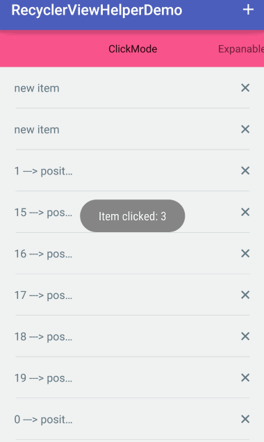

RecyclerViewHelper
============

Android library for easy to use `RecyclerView`

- Paginate
- Click/Select Mode
- Expandable

Features
--------

- [MarkoMilos/Paginate](https://github.com/MarkoMilos/Paginate): Wrapper RecyclerView.Adapter

- [lucasr/twoway-view](https://github.com/lucasr/twoway-view/): Implement RecyclerView.OnItemTouchListener

- [TellH/RecyclerTreeView](https://github.com/TellH/RecyclerTreeView) : Add or Remove items in RecyclerView.Adapter

Screenshot
--------


<br/>


Setup
--------

Gradle:
```groovy
compile 'com.bobomee.android:recyclerviewhelper:1.0.3'
```

Usage
--------

- Paginate : see [MarkoMilos/Paginate](https://github.com/MarkoMilos/Paginate) or [PaginateFragment](https://github.com/BoBoMEe/RecyclerViewHelper/blob/master/app/src/main/java/com/bobomee/android/recyclerviewhelperdemo/fragment/PaginateFragment.java)

- Select/Click: see [lucasr/twoway-view](https://github.com/lucasr/twoway-view/) or [ItemSelectFragment](https://github.com/BoBoMEe/RecyclerViewHelper/blob/master/app/src/main/java/com/bobomee/android/recyclerviewhelperdemo/fragment/ItemSelectFragment.java)

- Expanable : See [TellH/RecyclerTreeView](https://github.com/TellH/RecyclerTreeView) or [ExpandRecyclerFragment](https://github.com/BoBoMEe/RecyclerViewHelper/blob/master/app/src/main/java/com/bobomee/android/recyclerviewhelperdemo/fragment/ExpandRecyclerFragment.java)

Thanks
--------

- [MarkoMilos/Paginate](https://github.com/MarkoMilos/Paginate)
- [lucasr/twoway-view](https://github.com/lucasr/twoway-view/)
- [TellH/RecyclerTreeView](https://github.com/TellH/RecyclerTreeView)

